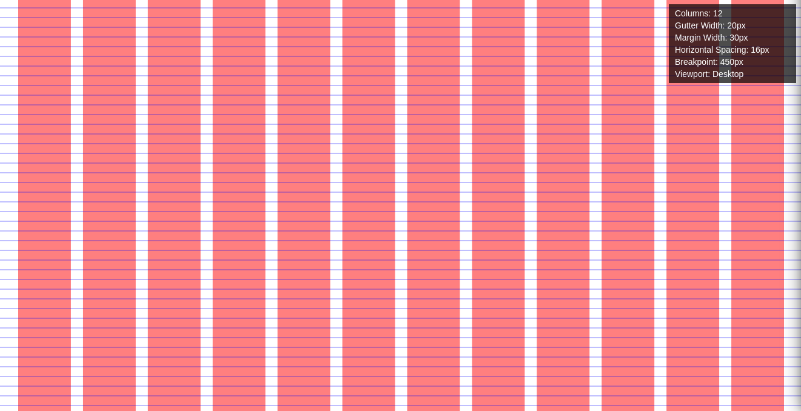
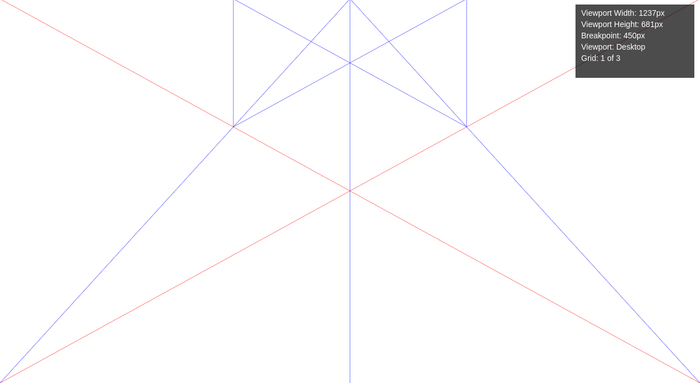
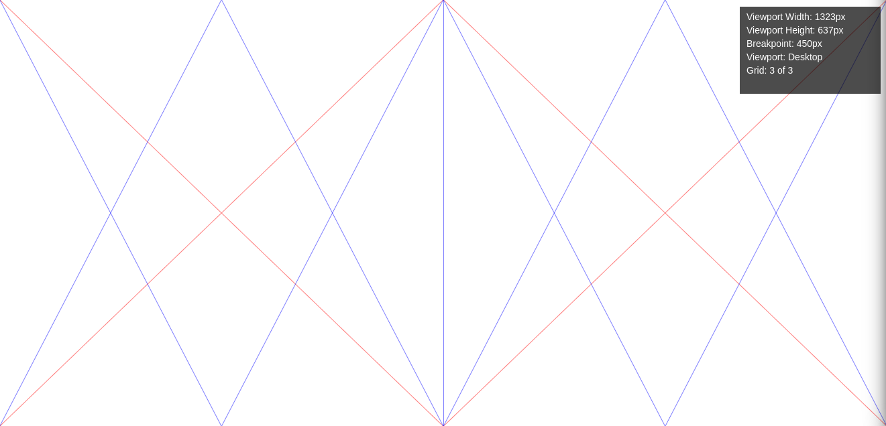
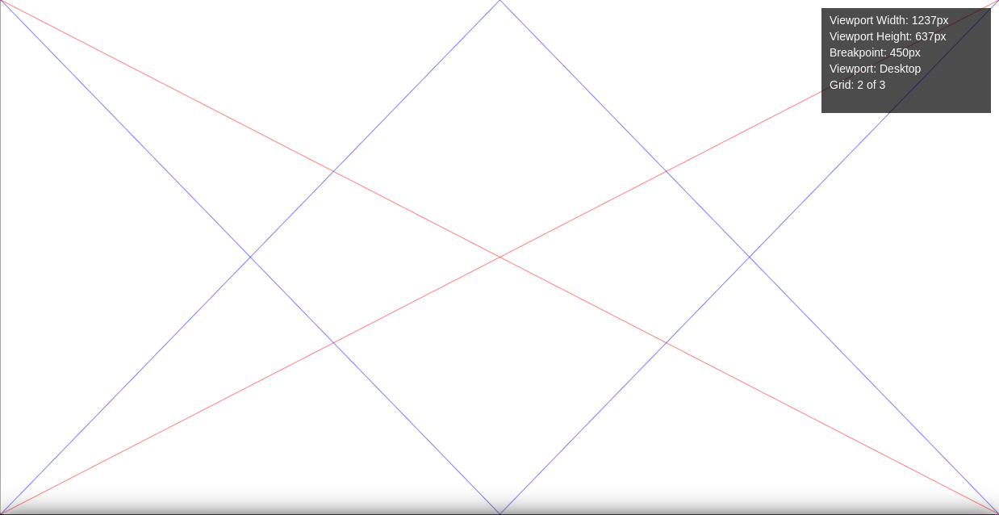

# Grid Overlay Script

This script provides a grid overlay that can switch between a column grid and a Van de Graaf grid on top of all other elements in the body of an HTML document.

Example on the [Lenis website](https://lenis.darkroom.engineering/)


<div style="display: flex; justify-content: space-around;">
  
  
  
  
</div>

## Features

- Toggles the grid overlay on and off with `Ctrl+G`.
- Switches between column and Van de Graaf grids with `Ctrl+L`.
- Cycles through different Van de Graaf grid types with `Ctrl+K` when in Van de Graaf mode.
- Toggles the display of horizontal lines with `Ctrl+K` when in column grid mode.
- Configurable number of columns, gutter width, margin width, and horizontal line spacing for both mobile and desktop views.
- Responsive grid that adapts based on a customizable breakpoint.
- Displays grid information (number of columns, gutter width, margin width, horizontal spacing, breakpoint, viewport type) on the second press of `Ctrl+G`.
- Hides the grid and information on the third press of `Ctrl+G`.

## Configuration

The script uses the following configuration settings:

```javascript
const settings = {
    desktop: {
        columns: 12,
        gutterWidth: 20,
        marginWidth: 30,
        horizontalSpacing: '1em',
    },
    mobile: {
        columns: 6,
        gutterWidth: 20,
        marginWidth: 0,
        horizontalSpacing: '1em',
    },
    breakpoint: 450,
    lineColors: {
        columns: 'rgba(255, 0, 0, 0.5)',
        lines: 'rgba(0, 0, 255, 0.5)',
        diagonals: 'rgba(255, 0, 0, 0.5)',
        others: 'rgba(0, 0, 255, 0.5)',
    }
};
```

## Usage

Include the script (`gridScript.js`) in your HTML document:

```html
<!DOCTYPE html>
<html lang="en">
<head>
    <meta charset="UTF-8">
    <meta name="viewport" content="width=device-width, initial-scale=1.0">
    <title>Grid Overlay Example</title>
</head>
<body>
    <!-- Your content here -->

    <script>
        // The script content goes here
    </script>
    <!-- or -->
    <script src="gridScript.js"></script>
</body>
</html>
```
You can also copy/paste the script directly in the dev console if you want to view the grid on an online website.

You can also use `column.js` or `vandegraaf.js` file if you want just one of this two option.

## Controls

- `Ctrl+G`: Toggle the grid overlay on and off.
- `Ctrl+K`: Toggle the display of horizontal lines in column grid mode or cycle through different Van de Graaf grid types.
- `Ctrl+L`: Switch between column and Van de Graaf grid types.

## Code of conduct, license, authors, changelog, contributing

See the following files:
- [Code of Conduct](CODE_OF_CONDUCT.md)
- [License](LICENSE)
- [Authors](AUTHORS)
- [Contributing](CONTRIBUTING.md)
- [Changelog](CHANGELOG)
- [Security](SECURITY.md)

## Roadmap

- Nothing yet, I take feature requests on the go :)

## Want to participate? Have a bug or a feature request?

Do not hesitate to open a PR or an issue. I reply when I can.

## Want to support my work?

- [Give me a tip](https://ko-fi.com/a2n00)
- [Give a star on GitHub](https://github.com/bouteillerAlan/grid)
- Or just participate in the development :D

### Thanks!
